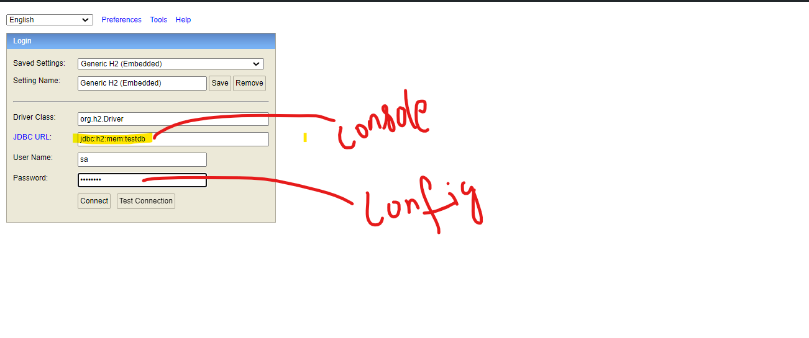
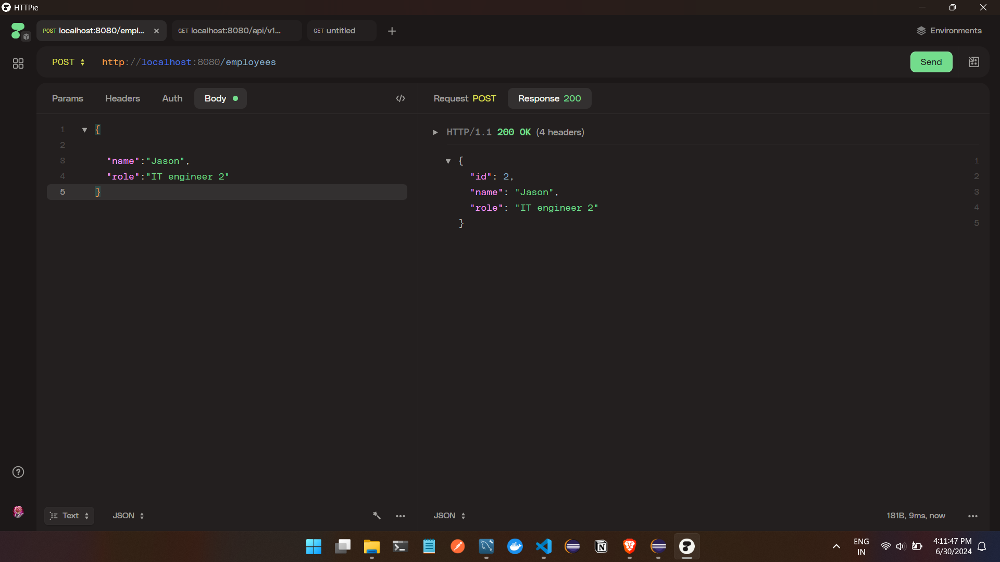
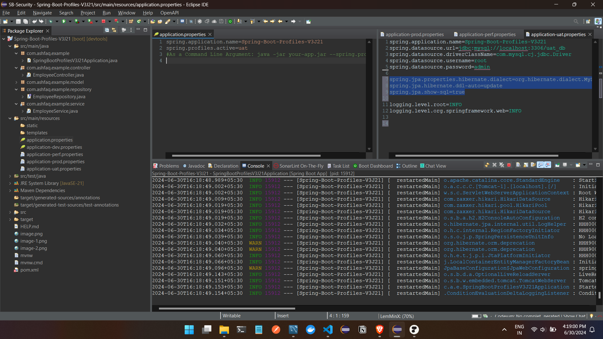
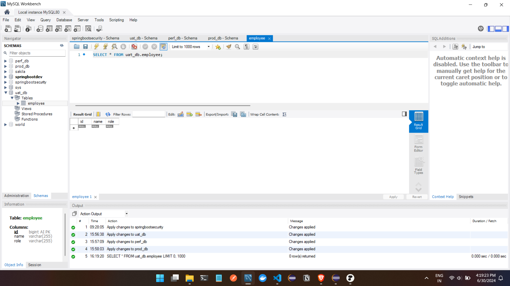
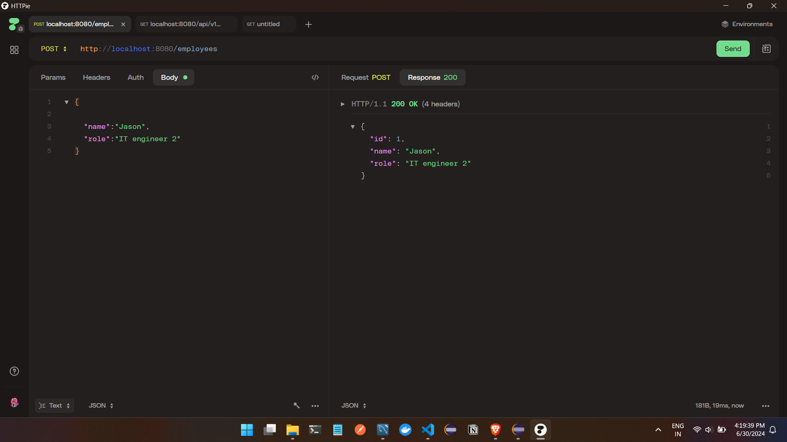

#profiles 

DEV 

issue resolution URL : https://stackoverflow.com/questions/58298381/database-c-data-sample-not-found-and-ifexists-true-so-we-cant-auto-create-i

UAT 

... for other regions with their repective configurations
